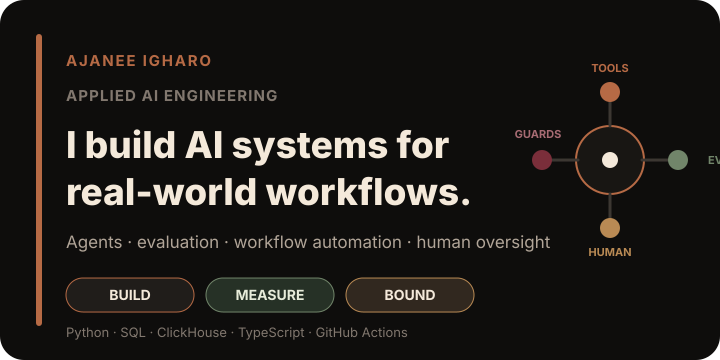
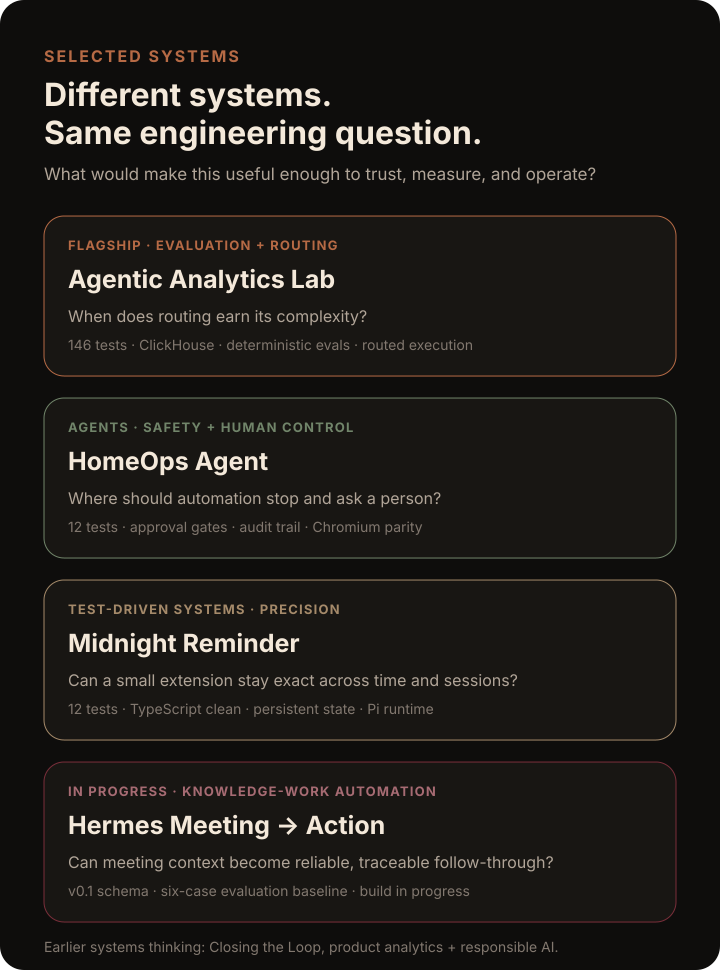

  

  <strong>Applied AI Engineer building systems for knowledge work.</strong> 
  I care about the gap between an impressive AI demo and a system someone could responsibly depend on.

  <a href="https://ajaneeigharo.com/"><strong>Portfolio</strong></a> ·
  <a href="https://ajaneeigharo.com/#work">Selected work</a> ·
  <a href="https://www.linkedin.com/in/ajaneeigharo/">LinkedIn</a> ·
  <a href="https://x.com/AjaneeIgharo">X</a>

---

## About

I build and evaluate AI systems for real organizational workflows.

My work focuses on the parts that sit around the model as much as the model itself: **tool access, structured data, evaluation, permissions, observability, failure handling, workflow design, and human judgment**.

I currently work as an **Applied AI Programs & Operations Coordinator** at the Paul English Applied Artificial Intelligence Institute at UMass Boston, and I am completing an **MBA at UMass Boston**.

My path into applied AI is interdisciplinary. Psychology taught me to pay attention to behavior, trust, and decision-making. Operations work taught me to see the systems surrounding a technology. Applied AI gave me a place to connect both by building, testing, debugging, and evaluating the technology itself.

## Selected systems

  

### [Agentic Analytics Lab](https://github.com/AjaneeI/agentic-analytics-lab) · flagship

**Question:** When does routing earn its complexity?

An evaluation-first analytics-agent lab comparing a strong single-agent baseline with routed execution over structured operational data.

**Evidence:** 146 tests on Python 3.11 and 3.12, read-only ClickHouse tooling, deterministic evaluation, CodeQL, route telemetry, and a reviewed oracle-metadata routed comparison.

[Repository →](https://github.com/AjaneeI/agentic-analytics-lab) · [Case study →](https://ajaneeigharo.com/work/agentic-analytics-lab)

### [HomeOps Agent](https://github.com/AjaneeI/homeops-agent)

**Question:** Where should automation stop and ask a person?

A safety-aware agent prototype that handles low-risk household operations while escalating lock, access, uncertainty, and failed-device conditions to a human-controlled path.

**Evidence:** 12 Python tests, 3.11/3.12 CI, approval gates, audit logging, deterministic failure handling, and Chromium scenario-parity verification.

[Repository →](https://github.com/AjaneeI/homeops-agent) · [Case study →](https://ajaneeigharo.com/work/homeops-agent)

### [Midnight Reminder](https://github.com/AjaneeI/midnight-reminder-pi-extension)

**Question:** Can a small extension stay precise across time and sessions?

A test-driven Pi extension with explicit time boundaries, injected clock and storage abstractions, cross-session duplicate prevention, and a safe runtime demo path.

**Evidence:** 12 passing tests across 4 files, clean TypeScript checks, persistent state, and verified Pi lifecycle behavior.

[Repository →](https://github.com/AjaneeI/midnight-reminder-pi-extension)

### [Hermes Meeting → Action](https://github.com/AjaneeI/hermes-meeting-action) · in progress

**Question:** Can meeting context become reliable, traceable follow-through?

A knowledge-work automation project for turning transcripts and recaps into structured decisions, actions, owners, due dates, open questions, and follow-up work without silently guessing missing information.

Current state: the v0.1 action schema and six-case evaluation baseline are defined. The extraction runner, validation path, logging, and idempotent writes are the next implementation gates.

[Repository →](https://github.com/AjaneeI/hermes-meeting-action)

## Engineering approach

> **Useful AI needs a baseline, a boundary, and a way to learn from failure.**

**Measure before adding complexity.** Start with the simplest credible baseline, define success, then justify additional architecture with evidence.

**Design boundaries intentionally.** Permissions, tool access, semantic rules, approval gates, and human oversight belong in the system design.

**Treat failure as evidence.** Wrong answers, tool failures, latency, edge cases, and route mistakes are useful only if the system makes them observable.

**Build for the surrounding workflow.** A technically interesting model is not automatically a useful product or operational system.

## Capability map

**Build**  
Python · SQL · TypeScript · structured data workflows · agent/tool interfaces

**Agent systems**  
tool use · routing · human-in-the-loop controls · workflow automation · guardrails

**Evaluate**  
deterministic checks · benchmark design · regression testing · failure attribution · CI

**Data + analytics**  
ClickHouse · Tableau · Excel · operational metrics · evidence-backed analysis

**Operate + communicate**  
GitHub Actions · auditability · observability · architecture docs · technical case studies

## Earlier product and analytics work

### [Closing the Loop in Customer Portal Journeys](https://github.com/AjaneeI/closing-the-loop-patient-portals)

A product and analytics case study on fragmented digital-service workflows, with KPI design, evidence synthesis, workflow states, responsible-AI boundaries, and a measurable closed-loop completion strategy.

[Repository →](https://github.com/AjaneeI/closing-the-loop-patient-portals) · [Case study →](https://ajaneeigharo.com/work/mychart-patient-portal)

## Selected publications & presentations

- [AI-Powered Personal Branding: A Coaching Toolkit for Career Advisors](https://scholarworks.umb.edu/ai_pubs/47/) · UMass Boston ScholarWorks, 2026
- [Spring AI 2026 Workshop and Speaker Series Report](https://scholarworks.umb.edu/ai_pubs/43/) · co-author, UMass Boston ScholarWorks, 2026
- [AI As An Equalizer: Empowering Underrepresented Students for High-Demand Careers](https://scholarworks.umb.edu/ai_pubs/16/) · UMass Boston ScholarWorks, 2025

## Direction

I am especially interested in **Applied AI Engineer, AI Engineer, AI Solutions Engineer, and AI Automation Engineer** work involving agents, evaluation, enterprise workflows, knowledge-work automation, analytics, and human oversight.

  <strong>Evidence before claims. Systems before hype.</strong>

  <a href="https://ajaneeigharo.com/">ajaneeigharo.com</a> ·
  <a href="https://www.linkedin.com/in/ajaneeigharo/">LinkedIn</a> ·
  <a href="https://x.com/AjaneeIgharo">X</a>

