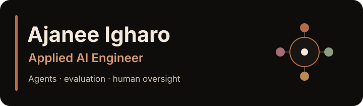

  

  <strong>Applied AI Engineer building systems for real organizational workflows.</strong> 
  I build tool-using agents, evaluate their behavior, and make their boundaries explicit.

  <a href="https://ajaneeigharo.com/"><strong>Portfolio</strong></a> ·
  <a href="#selected-work">Selected work</a> ·
  <a href="https://www.linkedin.com/in/ajaneeigharo/">LinkedIn</a>

## Selected work

<table>
  <tr>
    <td width="50%" valign="top">
      
<strong>01 · Evaluation lab</strong>

      <h3><a href="https://github.com/AjaneeI/agentic-analytics-lab">Agentic Analytics Lab</a></h3>
      
Single-agent vs. routed analytics over synthetic data, with read-only tools and deterministic scoring.

      
<code>Python</code> <code>SQL</code> <code>ClickHouse</code>

      
<a href="https://github.com/AjaneeI/agentic-analytics-lab/blob/main/ARCHITECTURE.md">Architecture</a> · <a href="https://github.com/AjaneeI/agentic-analytics-lab#evaluation-method">Evaluation</a> · <a href="https://github.com/AjaneeI/agentic-analytics-lab/actions">CI</a>

    </td>
    <td width="50%" valign="top">
      
<strong>02 · Safety prototype</strong>

      <h3><a href="https://github.com/AjaneeI/homeops-agent">HomeOps Agent</a></h3>
      
A simulated-device workflow with allowlisted actions, human approval requests, and inspectable failure handling.

      
<code>Python</code> <code>Strands</code> <code>Playwright</code>

      
<a href="https://github.com/AjaneeI/homeops-agent#safety-model">Safety model</a> · <a href="https://github.com/AjaneeI/homeops-agent#demo">Demo</a> · <a href="https://github.com/AjaneeI/homeops-agent/actions">CI</a>

    </td>
  </tr>
  <tr>
    <td width="50%" valign="top">
      
<strong>03 · Evidence prototype</strong>

      <h3><a href="https://github.com/AjaneeI/agent-systems-evidence-scout">Evidence Scout</a></h3>
      
An arXiv research agent that checks citations outside the model and withholds drafts with unverified citations.

      
<code>Python</code> <code>smolagents</code> <code>Gradio</code>

      
<a href="https://github.com/AjaneeI/agent-systems-evidence-scout#live-demo">Demo</a> · <a href="https://github.com/AjaneeI/agent-systems-evidence-scout#what-the-live-test-caught">Failure analysis</a> · <a href="https://github.com/AjaneeI/agent-systems-evidence-scout/actions">CI</a>

    </td>
    <td width="50%" valign="top">
      
<strong>04 · Product case study</strong>

      <h3><a href="https://github.com/AjaneeI/closing-the-loop-patient-portals">Closing the Loop</a></h3>
      
A portal-workflow concept connecting ownership, source-linked information, and a measurable definition of completion.

      
<code>Analytics</code> <code>KPI design</code>

      
<a href="https://github.com/AjaneeI/closing-the-loop-patient-portals/blob/main/docs/case-study.md">Case study</a> · <a href="https://github.com/AjaneeI/closing-the-loop-patient-portals/blob/main/docs/metrics-and-measurement.md">Metrics</a> · <a href="https://github.com/AjaneeI/closing-the-loop-patient-portals/blob/main/docs/research-and-evidence.md">Research</a>

    </td>
  </tr>
</table>

<strong>Engineering evidence and scope</strong>

**Agentic Analytics Lab — when does routing earn its complexity?** I built dataset-scoped ClickHouse tools, semantic metric guards, deterministic evaluation, and route telemetry. The reviewed oracle-metadata comparison supplies the intended route: it tests execution, not natural-language route selection or production performance. Regression tests and CI/CodeQL workflows accompany the experiments.

**HomeOps Agent — where should automation stop?** The Good Night Check workflow keeps uncertain lock states and failed devices on a human-controlled path. Deterministic policy tests and Chromium scenario-parity checks cover the public demo. Devices are simulated; this is not a production smart-home deployment.

**Agent Systems Evidence Scout — can citations be checked outside the model?** The model chooses research tools; deterministic Python checks arXiv citations against a per-run verification registry. Evidence includes offline regression tests, a documented live Hugging Face + arXiv run, and a browser-tested interface. Verification checks paper identity and sourcing, not whether every research conclusion is true.

**Closing the Loop — how do workflows reach completion?** This earlier product and analytics case study connects workflow states, KPI design, evidence synthesis, and responsible-AI boundaries. It is a concept based on secondary research, not deployed software. Proposed targets are hypotheses to validate, not measured outcomes.

## How I engineer

**Measure before adding complexity.** Start with a credible baseline and define success before adding orchestration.

**Put boundaries in code.** Tool permissions, structured contracts, approval gates, and failure handling should be testable outside the model.

**Make failures inspectable.** Record what happened, preserve evidence, and distinguish a convincing demo from a measured result.

**Core tools:** Python · SQL · TypeScript · ClickHouse · GitHub Actions · pytest · Playwright

## About

Alongside my engineering work, I am an **Applied AI Programs & Operations Coordinator** at the **Paul English Applied AI Institute, UMass Boston**, and an **MBA candidate**.

Psychology shaped how I think about behavior, trust, and decisions. Operations taught me to examine the workflow around the technology. Applied AI brings those perspectives into building, testing, and evaluating systems people can use.

Based in **Greater Boston**. Interested in applied AI engineering and AI solutions work involving agents, evaluation, and organizational workflows.

<strong>More engineering work</strong>

**[Midnight Reminder](https://github.com/AjaneeI/midnight-reminder-pi-extension)** · Implemented TypeScript extension with injected clock/storage interfaces, explicit time boundaries, cross-session duplicate prevention, and regression tests.

**[Hermes Meeting → Action](https://github.com/AjaneeI/hermes-meeting-action)** · In progress. Structured action schema and evaluation fixtures are defined; the extraction runner and durable integrations remain implementation gates.

<strong>Selected publications and presentations</strong>

- [AI-Powered Personal Branding: A Coaching Toolkit for Career Advisors](https://scholarworks.umb.edu/ai_pubs/47/) · UMass Boston ScholarWorks, 2026
- [Spring AI 2026 Workshop and Speaker Series Report](https://scholarworks.umb.edu/ai_pubs/43/) · Co-author, UMass Boston ScholarWorks, 2026
- [AI As An Equalizer: Empowering Underrepresented Students for High-Demand Careers](https://scholarworks.umb.edu/ai_pubs/16/) · UMass Boston ScholarWorks, 2025

---

  <strong>Evidence before claims. Systems before hype.</strong> 
  <a href="https://ajaneeigharo.com/">Portfolio</a> ·
  <a href="https://www.linkedin.com/in/ajaneeigharo/">LinkedIn</a> ·
  <a href="https://x.com/AjaneeIgharo">X</a>

